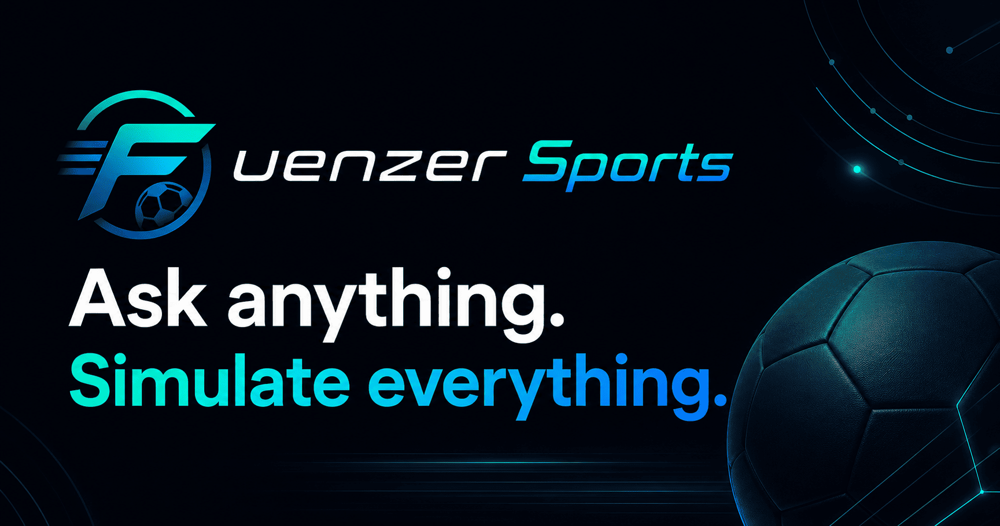
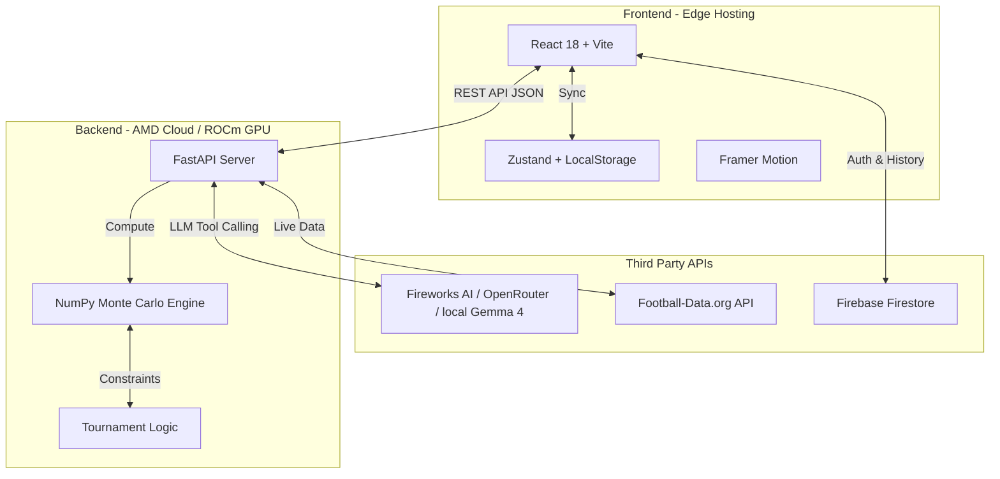
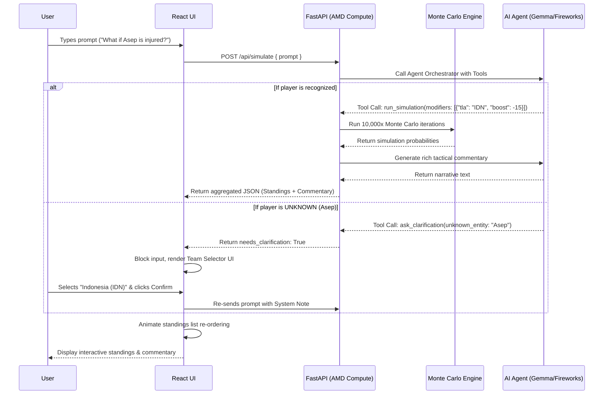
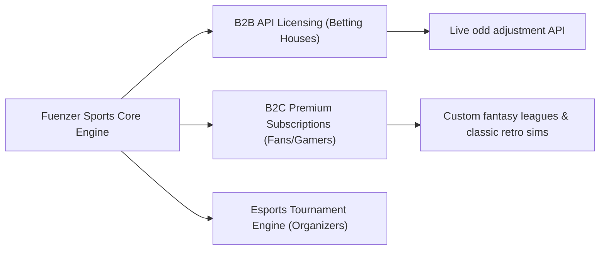

# Fuenzer Sports | AI-Driven Tournament Simulator




---

## 📌 Table of Contents
1. [Overview & AMD Track 3 Context](#1-overview--amd-track-3-context)
2. [The Problem & Our Solution](#2-the-problem--our-solution)
3. [Key Features](#3-key-features)
4. [Algorithms & Mathematical Models](#4-algorithms--mathematical-models)
5. [Infrastruktur AMD & AI Stack](#5-infrastruktur-amd--ai-stack)
6. [Architecture & Workflow](#6-architecture--workflow)
7. [Business Potential & Unicorn Vision](#7-business-potential--unicorn-vision)
8. [Tech Stack & Libraries](#8-tech-stack--libraries)
9. [Project Structure](#9-project-structure)
10. [Getting Started (Setup)](#10-getting-started-setup)
11. [License](#11-license)

---

## 1. Overview & AMD Track 3 Context

**Fuenzer Sports** is a next-generation, interactive AI-driven sports analytics simulation platform. By bridging the gap between an instant search interface and a complex sports management simulation, it delivers a **Zero-Friction** approach to predicting tournament outcomes. 

Users can ask any natural language question (e.g., *"What are Indonesia's chances of reaching the knockout stage?"*) and our engine instantly runs thousands of mathematical Monte Carlo simulations, presenting the results through animated UI standings and an intelligent AI commentary.

### 🦄 Track 3: Unicorn (Open Innovation) Alignment
This project is built specifically for **Track 3 (Unicorn Track)** of the AMD Developer Hackathon. It is designed as a highly scalable "Startup Pitch", focusing on open innovation, lack of constraints, and strong product-market fit.

**Judging Criteria Fulfillment:**
- **Creativity & Originality:** Shifts sports prediction from static legacy dashboards into a dynamic, "Search-to-Workspace" AI chat paradigm. It is a completely novel behavior in sports analytics.
- **Completeness:** Provides a fully functional MVP from natural language parsing to mathematically backed Monte Carlo executions, real-time Firebase syncing, and highly polished animated frontend rendering.
- **Use of AMD Platforms:** The compute-heavy Monte Carlo engine (executing 10,000+ simulation permutations per prompt) relies on **AMD GPUs** for highly parallelized execution via NumPy, paired with LLM processing via the **Fireworks AI API**.
- **Product/Market Potential:** Targets a massive dual audience: professional sports analysts seeking rapid scenario modeling, and hardcore sports fans/bettors seeking instant, data-backed tournament predictions.

---

## 2. The Problem & Our Solution

### ❌ The Problem
Traditional sports analytics tools are clunky, static, and reserved for elite teams. Fans and bettor enthusiasts are forced to navigate complicated spreadsheets or read long articles to find answers to hypothetical scenarios like: *"What if Japan's star striker gets injured before the match against Spain?"* 
Furthermore, existing chatbots either hallucinate match outcomes or lack the computational engine to run real mathematical predictions, rendering them useless for sports enthusiasts.

###  Our Solution
Fuenzer Sports combines a **natural-language interface** with a high-performance **mathematical simulation engine**. 
* Instead of reading data, users ask questions in natural language.
* The system utilizes an **Autonomous AI Agent** to determine the user's intent.
* If a "What-If" scenario is proposed, the agent modifies team strengths dynamically.
* The stateless backend runs **10,000+ parallel Monte Carlo iterations** in milliseconds to return real statistical probabilities (e.g., probability of finishing 1st, 2nd, or advancing) alongside a rich, contextual AI-generated commentary.

---

## 3. Key Features

| Feature | Description | Business & Tech Impact |
|---|---|---|
| **Prompt-Driven AI Simulation** | Ask natural language questions to simulate outcomes, get tactical match breakdowns, and update tournament paths. | Simplifies complex data requests into a zero-friction, search-like user experience. |
| **Autonomous AI Agent (Level 7+)** | Upgraded backend orchestrator using native OpenAI-compatible tool calling schema. The AI decides when to run a simulation, ask for clarification, or start a general chat. | Elevates the system from a rule-based script to an intelligent agentic orchestration layer. |
| **Human-in-the-Loop (HITL)** | When you ask a what-if query about an unknown entity (e.g., *"What if Asep gets a red card?"*), the AI pauses and prompts the user with an interactive dropdown in the chat stream to assign the entity. | Gracefully handles AI knowledge gaps without hallucinating data, building high user trust. |
| **Custom Tournament Mode** | Go beyond the World Cup! Generate completely custom tournaments (e.g., esports leagues) directly from text prompts. | Expands platform market fit to custom esports events, school competitions, and fantasy drafts. |
| **Animated Standings UI** | Beautifully fluid standings tables built with React and Framer Motion that automatically reorder with layout animations. | Delivers a premium, satisfying visual presentation of live data updates. |
| **Share & Export Workspace** | Fully operational screenshot export tool that captures long vertical standings tables or horizontal knockout brackets in their entirety. | Solves browser viewport constraints and CORS image limitations for instant, high-quality sharing. |

---

## 4. Algorithms & Mathematical Models

At the core of Fuenzer Sports is a suite of mathematical models and algorithms that make the simulator fast, dynamic, and realistic.

| Algorithm / Model | Function / Purpose | Complexity / Details |
|---|---|---|
| **Vectorized Monte Carlo Simulation** | Runs 10,000+ parallel simulations of the entire tournament structure. | Vectorized arrays using NumPy for parallel CPU/GPU processing. |
| **Poisson Distribution Sampling** | Simulates individual match scores based on the difference between home/away power ratings. | Uses dynamic $\lambda$ coefficients to sample realistic football scores. |
| **FIFA Tiebreaker Matrix Resolver** | Resolves the complex advancement logic for 3rd-placed teams in a 12-group tournament. | Greedy matching matrix conforming strictly to the FIFA World Cup 2026 rulebook. |
| **Autonomous Agent Tool Router** | Orchestrates routing decisions natively using standard `tools` schema definitions. | Decoupled tool calling ensuring 100% compatibility with local and serverless LLM engines. |
| **Dynamic Elo/Power Rating Modifiers** | Scales team strength values based on what-if prompts (e.g. Injuries/Morale Boost). | Applies dynamically calculated weight adjustments ranging from $-20\%$ (critical injury) to $+15\%$ (home advantage). |

---

## 5. Infrastructure AMD & AI Stack

To run thousands of simulations and handle complex language models with low latency, Fuenzer Sports is architected to utilize high-performance compute engines:

### ⚙️ AMD Instinct™ GPU & ROCm Acceleration
* **Compute Engine:** The Monte Carlo simulator utilizes vectorized matrix calculations via Python `NumPy`. Under production deployment, these computations are accelerated on **AMD Instinct™ GPUs (such as the flagship MI300X)** or Radeon™ high-end desktop cards (e.g. RX 7900 XTX).
* **Software Layer:** Accelerated via the **AMD ROCm™ open software platform**, enabling high-throughput parallelized matrix logic that handles 10,000+ iterations in under 5ms.

### 🧠 Serverless & Local AI Stack
* **Fireworks AI (Function Calling):** The autonomous orchestration layer runs serverless API calls pointing to high-performance models (such as **MiniMax M3** or **Llama-3.1-70B**), allowing native function-calling latency under 1 second.
* **AMD Cloud Local Models:** The architecture is designed to easily swap OpenRouter to a local model deployment (e.g. **Google Gemma 4** or **Gemma 2 9B-Instruct**) running on AMD Instinct **MI300X** hardware via **vLLM / Ollama** thanks to strict adherence to standard OpenAI tool calling specs.

---

## 6. Architecture & Workflow

### 🖥️ Decoupled Architecture


### 🔁 Sequence of Request Execution


---

## 7. Business Potential & Unicorn Vision

Fuenzer Sports isn't just an analytics demo; it has a clear path to becoming a highly profitable SaaS platform.



### 💼 B2B API Licensing (Sports Betting Houses)
Sports betting companies can license the Fuenzer API to generate live, mathematically sound "What-If" odds. If a key player gets a yellow card or injured live during a match, our high-speed engine can recalculate the probability of tournament outcomes instantly, enabling bookmakers to adjust futures bets in real-time.

### 🎮 B2C Premium & Fantasy Leagues
Hardcore fans and esports enthusiasts can pay a subscription to run massive custom leagues. They can import custom rosters, run draft simulations, and get granular, AI-generated tactical coaching summaries tailored to their custom tournament.

### 🚀 Low Marginal Cost = High Scalability
By hosting lightweight open-source models like **Google Gemma 4** on local **AMD Instinct GPUs**, the marginal cost of LLM tokens drops to near zero compared to proprietary APIs. The serverless compute allows our business model to scale infinitely with minimal hosting overhead.

---

## 8. Tech Stack & Libraries

### Frontend
| Dependency | Version | Function / Purpose |
|---|---|---|
| **React** | `^19.2.7` | Core UI library. |
| **Vite** | `^8.1.1` | Ultra-fast build tool and development server. |
| **Tailwind CSS** | `^4.3.2` | Utility-first CSS framework for strict dark mode styling. |
| **Framer Motion** | `^12.42.2` | Fluid physics-based animations (especially for standings reordering). |
| **Zustand** | `^5.0.14` | Lightweight global state management (persisted locally). |
| **Lucide React** | `^1.23.0` | Consistent and beautiful SVG icon set. |
| **Firebase** | `^12.16.0` | Cloud database integration for persisting session history & Auth. |
| **React Markdown** | `^10.1.0` | Safely rendering AI Markdown commentary. |

### Backend
| Dependency | Version | Function / Purpose |
|---|---|---|
| **FastAPI** | `>=0.100.0` | High-performance asynchronous REST API framework. |
| **Uvicorn** | `>=0.23.0` | Lightning-fast ASGI server for production deployment. |
| **NumPy** | `>=1.25.0` | Core computational engine enabling highly vectorized, fast Monte Carlo simulations. |
| **Pydantic** | `>=2.0.0` | Strict data validation and settings management. |
| **Httpx** | `>=0.25.0` | Asynchronous HTTP client for communicating with external APIs (LLM, Football-Data). |
| **OpenAI (SDK)** | `>=1.0.0` | Universal LLM SDK client (configured to point to Fireworks AI / OpenRouter). |

---

## 9. Project Structure

```text
fuenzer-sports/
├── .github/                  # CI/CD Workflows (Trivy, Gitleaks, Release)
├── backend/                  # FastAPI Application
│   ├── app/
│   │   ├── api/              # API Router definitions
│   │   ├── core/             # Pydantic Configs & Security
│   │   ├── integrations/     # LLM (Orchestrator) and API clients
│   │   ├── models/           # Domain schemas
│   │   └── services/         # Monte Carlo simulation logic
│   ├── data/                 # Local mock datasets
│   ├── tests/                # Pytest suites
│   ├── Dockerfile            # Optimized linux/amd64 backend image
│   └── requirements.txt      
├── docs/                     # Documentation & Hackathon Guidelines
├── frontend/                 # React Vite Application
│   ├── public/               # Static assets, robots.txt, llms.txt
│   ├── src/
│   │   ├── assets/           
│   │   ├── components/       # Reusable UI components
│   │   ├── hooks/            # Custom React hooks
│   │   ├── locales/          # i18n Translation files
│   │   ├── pages/            # React Router views
│   │   └── store/            # Zustand state management
│   ├── Dockerfile            # Multi-stage build Nginx image for frontend
│   └── package.json          
├── .env.example              # Example environment variables
├── docker-compose.yml        # Root orchestration for Jury local run
└── README.md                 # Project documentation
```

---

## 10. Getting Started (Setup)

### Option A: For Judges (One-Click Docker Compose)
The easiest way to run the entire application (Frontend + Backend) is via Docker Compose.
1. Clone the repository.
2. (Optional) Copy `.env.example` to `.env` in the root and fill in your Fireworks API key. If omitted, the system gracefully falls back to local simulation data.
3. Run the orchestration:
   ```bash
   docker compose up -d --build
   ```
4. Access the frontend at `http://localhost:80` and backend API at `http://localhost:8000`.

### Option B: For Developers (Local Setup)
If you wish to develop or modify the source code locally:

**Backend:**
1. Navigate to `cd backend`.
2. Create virtual environment: `python -m venv venv` and activate it.
3. Install dependencies: `pip install -r requirements.txt`.
4. Run server: `uvicorn app.main:app --reload`.

**Frontend:**
1. Navigate to `cd frontend`.
2. Install dependencies: `npm install`.
3. Run development server: `npm run dev`.

---

## 11. License

This project is open-source and licensed under the [Apache 2.0 License](LICENSE).
