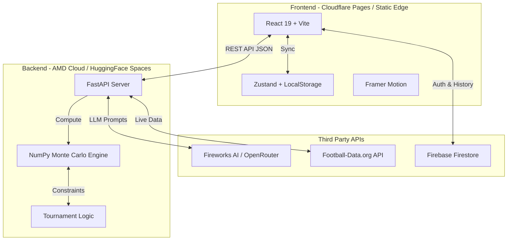
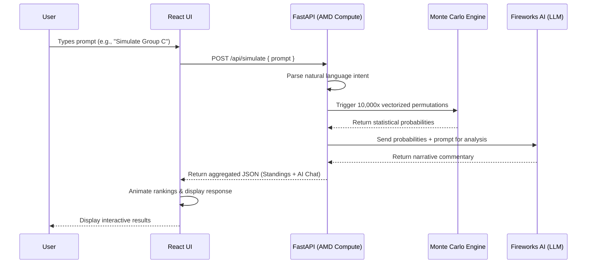

# Fuenzer Sports | AI-Driven Tournament Simulator


## Table of Contents
1. [Overview & AMD Track 3 Context](#1-overview--amd-track-3-context)
2. [Features](#2-features)
3. [Architecture](#3-architecture)
4. [Workflow & User Journey](#4-workflow--user-journey)
5. [Tech Stack & Libraries](#5-tech-stack--libraries)
6. [Project Structure](#6-project-structure)
7. [Getting Started (Setup)](#7-getting-started-setup)
8. [License](#8-license)

---

## 1. Overview & AMD Track 3 Context

**Fuenzer Sports** is a next-generation, interactive AI-driven sports analytics simulation platform. By bridging the gap between an instant search interface and a complex sports management simulation, it delivers a Zero-Friction approach to predicting tournament outcomes. 

Users can ask any natural language question (e.g., *"What are Argentina's chances of reaching the World Cup finals?"*) and our engine instantly runs thousands of mathematical Monte Carlo simulations, presenting the results through animated UI standings and an intelligent AI commentary.

### 🦄 Track 3: Unicorn (Open Innovation) Alignment
This project is built specifically for **Track 3 (Unicorn Track)** of the AMD Developer Hackathon. It is designed as a highly scalable "Startup Pitch", focusing on open innovation, lack of constraints, and strong product-market fit.

**Judging Criteria Fulfillment:**
- **Creativity & Originality:** Shifts sports prediction from static legacy dashboards into a dynamic, "Search-to-Workspace" AI chat paradigm. It is a completely novel behavior in sports analytics.
- **Completeness:** Provides a fully-functional MVP from natural language parsing to mathematically backed Monte Carlo executions, real-time Firebase syncing, and highly polished animated frontend rendering.
- **Use of AMD Platforms:** The compute-heavy Monte Carlo engine (executing 10,000+ simulation permutations per prompt) relies on **AMD GPUs** for highly parallelized execution via NumPy, paired with LLM processing via the **Fireworks AI API**.
- **Product/Market Potential:** Targets a massive dual audience: professional sports analysts seeking rapid scenario modeling, and hardcore sports fans/bettors seeking instant, data-backed tournament predictions.

---

## 2. Features

| Feature | Description |
|---|---|
| **Prompt-Driven AI Simulation** | "Stitch-style" search interface allowing users to run complex tournament simulations simply by asking natural language questions. |
| **Monte Carlo Engine** | Highly parallel mathematical engine capable of running 10,000+ simulation iterations instantly using vectorized NumPy arrays. |
| **Knockout Bracket Algorithm** | Efficient O(1) greedy matching algorithm specifically crafted for 3rd-place team advancement scenarios in the World Cup Round of 32. |
| **Stateless Architecture** | 100% stateless backend compute. Chat sessions, user states, and simulation histories are fully managed client-side via Zustand, Firebase, and localStorage. |
| **Animated Standings UI** | Beautifully fluid, interactive UI built with React, Tailwind CSS, and Framer Motion layout animations for real-time rank updates. |
| **AI Smart Commentary** | LLM-driven post-simulation analysis that contextually explains the statistical results provided by the Monte Carlo engine. |

---

## 3. Architecture

The system utilizes a fully decoupled architecture separating static edge hosting from heavy GPU compute.



---

## 4. Workflow & User Journey

This describes the end-to-end data flow when a user queries the engine.



---

## 5. Tech Stack & Libraries

### Frontend
| Dependency | Version | Function / Purpose |
|---|---|---|
| **React** | `^19.2.7` | Core UI library. |
| **Vite** | `^8.1.1` | Ultra-fast build tool and development server. |
| **Tailwind CSS** | `^4.3.2` | Utility-first CSS framework for strict dark mode styling. |
| **Framer Motion** | `^12.42.2` | Fluid physics-based animations (especially for standings reordering). |
| **Zustand** | `^5.0.14` | Lightweight global state management (persisted locally). |
| **Lucide React** | `^1.23.0` | Consistent and beautiful SVG icon set. |
| **Firebase** | `^12.16.0` | Cloud database integration for persisting session history & Auth. |
| **React Markdown** | `^10.1.0` | Safely rendering AI Markdown commentary. |

### Backend
| Dependency | Version | Function / Purpose |
|---|---|---|
| **FastAPI** | `>=0.100.0` | High-performance asynchronous REST API framework. |
| **Uvicorn** | `>=0.23.0` | Lightning-fast ASGI server for production deployment. |
| **NumPy** | `>=1.25.0` | Core computational engine enabling highly vectorized, fast Monte Carlo simulations. |
| **Pydantic** | `>=2.0.0` | Strict data validation and settings management. |
| **Httpx** | `>=0.25.0` | Asynchronous HTTP client for communicating with external APIs (LLM, Football-Data). |
| **OpenAI (SDK)** | `>=1.0.0` | Universal LLM SDK client (configured to point to Fireworks AI / OpenRouter). |

---

## 6. Project Structure

```text
fuenzer-sports/
├── .github/                  # CI/CD Workflows (Trivy, Gitleaks, Release)
├── backend/                  # FastAPI Application
│   ├── app/
│   │   ├── api/              # API Router definitions
│   │   ├── core/             # Pydantic Configs & Security
│   │   ├── integrations/     # LLM and External API clients
│   │   ├── models/           # Domain schemas
│   │   └── services/         # Monte Carlo simulation logic
│   ├── data/                 # Local mock datasets
│   ├── tests/                # Pytest suites
│   ├── Dockerfile            # Optimized linux/amd64 backend image
│   └── requirements.txt      
├── docs/                     # Documentation & Hackathon Guidelines
├── frontend/                 # React Vite Application
│   ├── public/               # Static assets, robots.txt, llms.txt
│   ├── src/
│   │   ├── assets/           
│   │   ├── components/       # Reusable UI components
│   │   ├── hooks/            # Custom React hooks
│   │   ├── locales/          # i18n Translation files
│   │   ├── pages/            # React Router views
│   │   └── store/            # Zustand state management
│   ├── Dockerfile            # Multi-stage build Nginx image for frontend
│   └── package.json          
├── .env.example              # Example environment variables
├── docker-compose.yml        # Root orchestration for Jury local run
└── README.md                 # Project documentation
```

---

## 7. Getting Started (Setup)

### Option A: For Judges (One-Click Docker Compose)
The easiest way to run the entire application (Frontend + Backend) is via Docker Compose.
1. Clone the repository.
2. (Optional) Copy `.env.example` to `.env` in the root and fill in your Fireworks API key. If omitted, the system gracefully falls back to local simulation data.
3. Run the orchestration:
```bash
docker compose up -d --build
```
4. Access the frontend at `http://localhost:80` and backend API at `http://localhost:8000`.

### Option B: For Developers (Local Setup)
If you wish to develop or modify the source code locally:

**Backend:**
1. Navigate to `cd backend`.
2. Create virtual environment: `python -m venv venv` and activate it.
3. Install dependencies: `pip install -r requirements.txt`.
4. Run server: `uvicorn app.main:app --reload`.

**Frontend:**
1. Navigate to `cd frontend`.
2. Install dependencies: `npm install`.
3. Run development server: `npm run dev`.

---

## 8. License

This project is open-source and licensed under the [MIT License](LICENSE).
